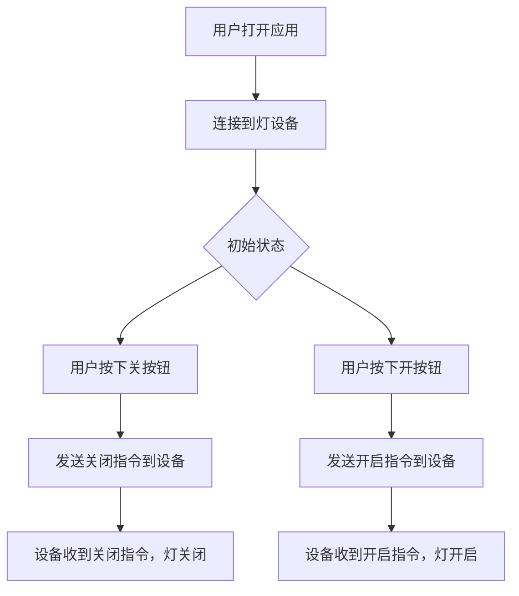
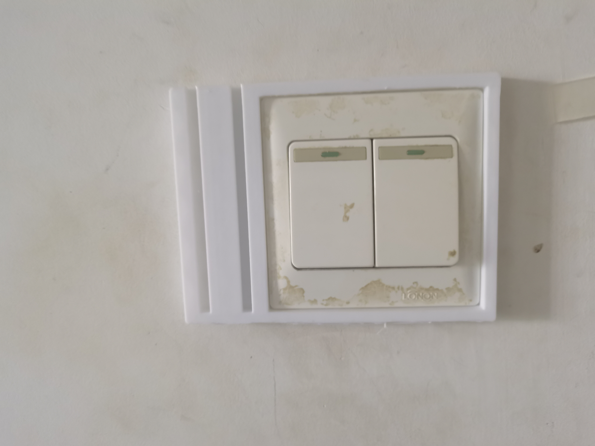
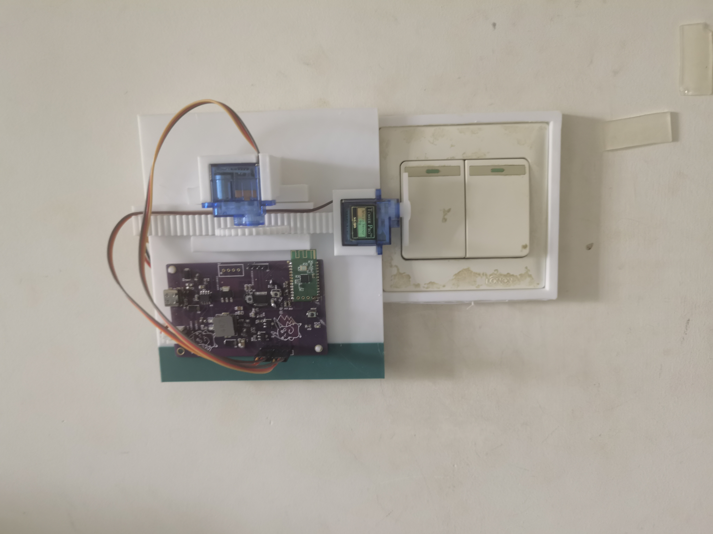
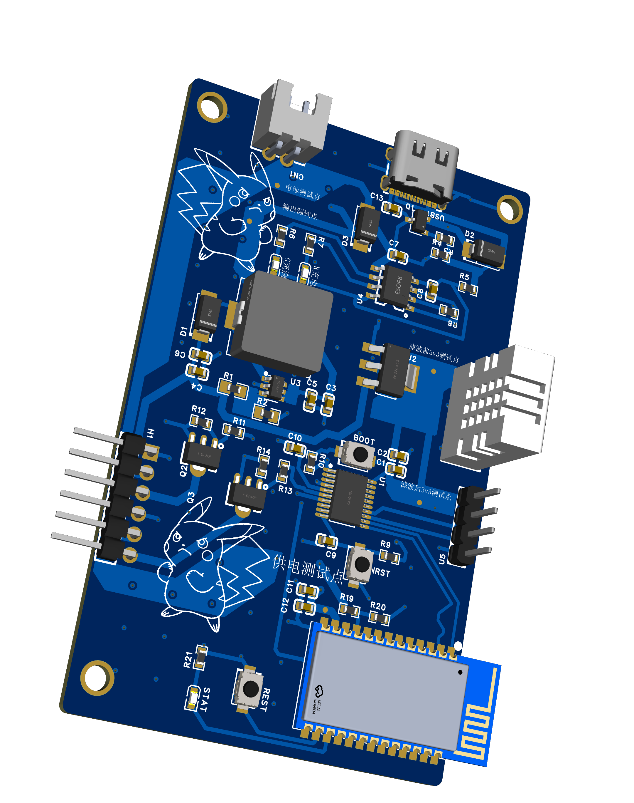
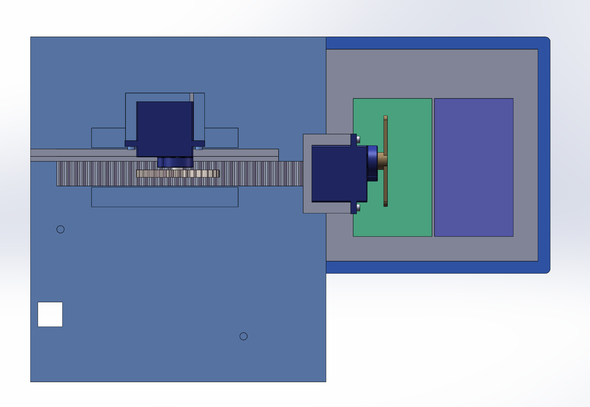
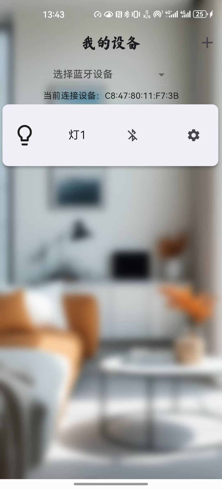

# 懒人开关灯

🚨 注意: 这是个人开发的玩具项目，练手项目，请勿直接复用，出现问题概不负责(●'◡'●) 🚨

**Version: 0.1**

## 项目简介

在不改变电路结构的基础上，实现通过手机蓝牙控制开关灯

### 项目特点

- 无需破坏现有设备，特别适合我这样的租房人群
- 电路实现了电源电池切换，可以使用电源直接供电，也可以使用锂电池供电
- 使用手机APP控制，随时开关灯（后期可通过蓝牙网关接入米家之类的）
- 双舵机适配不同开关数量
- 外壳采用滑槽设计，方便拿下来充电

## 技术栈

涉及以下技术：

- **PCB设计**: 
- **Arduino**: 
- **SolidWorks**: 
- **Flutter**: 

## 项目图片展示

## 项目图片展示

  

    
  

  

    
  

  

    
  

  

    
  

  

    
  

